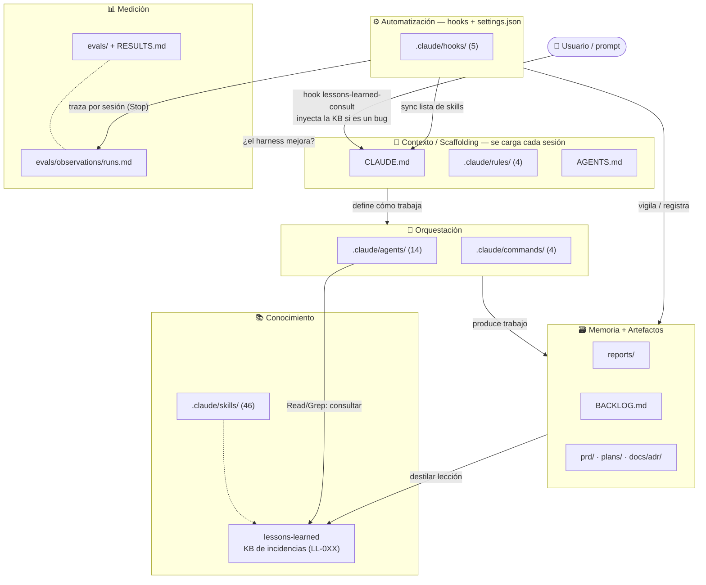
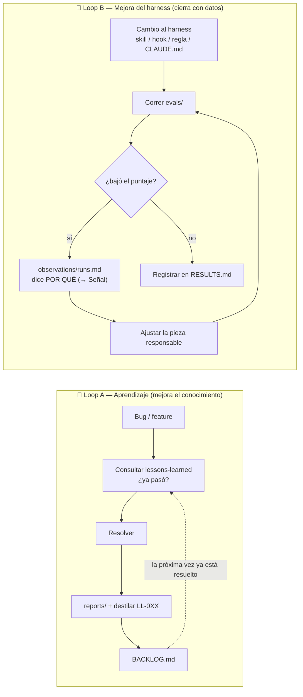
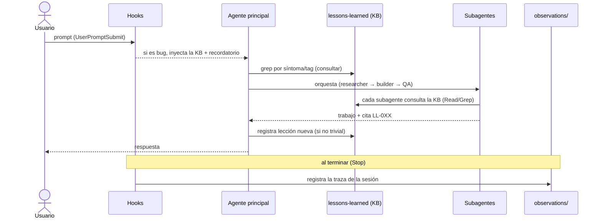

# Diagrama del harness (Mermaid)

Diagramas del funcionamiento del harness de IA del proyecto. Render nativo en GitHub.
Explicación completa en [docs/guides/harness-arquitectura.md](../guides/harness-arquitectura.md).

> Nota: el resto de diagramas de esta carpeta usan PlantUML (`.puml`); este usa Mermaid embebido en
> Markdown porque describe el harness de tooling (no el dominio de la app).

---

## 1. Arquitectura por capas y comunicación

---

## 2. Los dos loops del funcionamiento

---

## 3. Flujo de una sesión orquestada (secuencia)

---

## Leyenda

- **Flecha sólida** → flujo/acción directa.
- **Flecha punteada** → relación o realimentación (feedback).
- Cada caja referencia un elemento real del repo (ver la estructura en
  [harness-arquitectura.md](../guides/harness-arquitectura.md)).
