# 📊 Reporte de Actualización de Arquitectura - Sistema de Gestión de Proyectos

**Fecha:** 2026-02-11
**Versión:** 1.1.0
**Autor:** Claude Sonnet 4.5

---

## 📋 Resumen Ejecutivo

Se ha completado la actualización de la arquitectura del sistema para soportar la nueva funcionalidad de **Gestión Avanzada de Proyectos**, que transforma el módulo básico de proyectos en un sistema completo de organización de credenciales, documentos, enlaces, notas y configuraciones.

### 🎯 Cambios Principales

#### **1. PRD Actualizado** (`prd/rbac-subscription-system.md`)

Se agregó funcionalidad completa de gestión de proyectos con:

**Nuevos Modelos de Datos:**
- `ProjectSection` - Tags/secciones dentro de proyectos
- `ProjectItem` - Items dentro de secciones con 5 tipos
- `ProjectItemField` - Campos customizables con encriptación
- `ProjectMember` - Actualizado con roles granulares

**Características Implementadas:**
- ✅ Organización jerárquica por secciones/tags
- ✅ Items con campos customizables dinámicos
- ✅ 5 tipos de items: Credenciales, Documentos, Enlaces, Notas, Configuraciones
- ✅ Encriptación AES-256 para passwords
- ✅ Operaciones batch (Professional+)
- ✅ Importación/exportación CSV/JSON
- ✅ Búsqueda full-text (Professional+)
- ✅ Roles granulares: Owner, Admin, Editor, Viewer
- ✅ Auditoría completa de cambios
- ✅ 20 endpoints API REST nuevos

**Límites por Plan:**
| Plan | Proyectos | Secciones | Items |
|------|-----------|-----------|-------|
| Free | 2 | 3 | 50 |
| Starter | 10 | 10 | 200 |
| Professional | Unlimited | Unlimited | Unlimited |
| Enterprise | Unlimited + webhooks + API | Unlimited | Unlimited |

---

#### **2. Entity-Relationship Diagram Actualizado**

**Nuevas Entidades (4):**
1. **ProjectSection** - Agrupa items por tags/categorías
2. **ProjectItem** - Items con tipos y campos customizables
3. **ProjectItemField** - Campos dinámicos con encriptación
4. **ProjectMember** - Refactorizado con herencia de TenantAwareModel

**Nuevas Relaciones (8):**
- Project → ProjectSection (one-to-many)
- Tenant → ProjectSection (RLS)
- ProjectSection → ProjectItem (one-to-many)
- Tenant → ProjectItem (RLS)
- ProjectItem → ProjectItemField (one-to-many)
- User → ProjectItem (created_by/updated_by)
- Tenant → ProjectMember (RLS)

**Características de Seguridad:**
- ✅ Row-Level Security (RLS) en todas las entidades
- ✅ Auditoría con created_by/updated_by
- ✅ Encriptación AES-256 en ProjectItemField
- ✅ Constraints únicos para integridad
- ✅ Indexes compuestos para performance

---

#### **3. Components Diagram Actualizado**

**Nuevos Componentes:**
- `ProjectService` - Servicio backend para lógica de proyectos

**Conexiones Corregidas:**
- `ProjectsAPI → ProjectService` (antes apuntaba a TaskService)

**Nuevo Data Flow Example (N4):**
Flujo completo para crear items con credenciales encriptadas:
1. Usuario completa formulario
2. POST /api/v1/app/projects/{id}/sections/{id}/items
3. JWT + Tenant + Permission Middleware
4. Feature Gate valida límites del plan
5. ProjectService crea ProjectItem + ProjectItemFields
6. Passwords encriptados con AES-256
7. AuditLog registra acción
8. PostgreSQL commit con RLS
9. Response 201 Created
10. Frontend muestra password oculto (•••)

---

## 📐 Diagramas de Arquitectura

### 1. Entity-Relationship Diagram (ERD)

```plantuml
@startuml entity-relationship-diagram
' ==============================================================================
' Entity-Relationship Diagram (ERD)
' Sistema Avanzado de Gestión de Roles, Permisos y Suscripciones Multi-Tenant
' ==============================================================================
' Tech Stack: Django REST Framework + PostgreSQL
' Version: 1.1.0
' Date: 2026-02-11
' ==============================================================================

!define TABLE(x) class x << (T,#FFAAAA) >>
!define PK(x) <b><color:red>PK:</color> x</b>
!define FK(x) <color:blue>FK:</color> x
!define UK(x) <color:green>UK:</color> x

skinparam linetype ortho
skinparam class {
    BackgroundColor<<Tenant>> LightBlue
    BackgroundColor<<User>> LightGreen
    BackgroundColor<<RBAC>> LightYellow
    BackgroundColor<<Subscription>> LightSalmon
    BackgroundColor<<Audit>> LightGray
    BackgroundColor<<Services>> Lavender
}

' ==============================================================================
' CORE ENTITIES - Multi-Tenancy
' ==============================================================================

entity "Tenant" as tenant <<Tenant>> {
    PK(id): UUID
    --
    UK(subdomain): VARCHAR(255)
    name: VARCHAR(255)
    logo: VARCHAR(500)
    primary_color: VARCHAR(7)
    settings: JSONB
    --
    ' Subscription fields
    subscription_plan: VARCHAR(50)
    subscription_status: VARCHAR(20)
    trial_ends_at: TIMESTAMP
    subscription_current_period_end: TIMESTAMP
    stripe_customer_id: VARCHAR(255)
    --
    created_at: TIMESTAMP
    updated_at: TIMESTAMP
}

entity "User" as user <<User>> {
    PK(id): UUID
    --
    UK(email): VARCHAR(255)
    password: VARCHAR(255)
    first_name: VARCHAR(150)
    last_name: VARCHAR(150)
    is_active: BOOLEAN
    is_staff: BOOLEAN
    is_superuser: BOOLEAN
    email_verified_at: TIMESTAMP
    --
    ' MFA fields
    mfa_enabled: BOOLEAN
    mfa_secret: VARCHAR(32)
    --
    last_login: TIMESTAMP
    created_at: TIMESTAMP
    updated_at: TIMESTAMP
}

' ==============================================================================
' CUSTOMER SERVICES ENTITIES - Projects Module (UPDATED)
' ==============================================================================

entity "Project" as project <<Services>> {
    PK(id): UUID
    --
    FK(tenant_id): UUID
    name: VARCHAR(255)
    description: TEXT
    status: VARCHAR(20)
    start_date: DATE
    end_date: DATE
    FK(owner_id): UUID
    color: VARCHAR(7)
    --
    FK(created_by_id): UUID
    FK(updated_by_id): UUID
    created_at: TIMESTAMP
    updated_at: TIMESTAMP
}

entity "ProjectSection" as project_section <<Services>> {
    PK(id): UUID
    --
    FK(tenant_id): UUID
    FK(project_id): UUID
    name: VARCHAR(100)
    description: TEXT
    order: INTEGER
    color: VARCHAR(7)
    --
    created_at: TIMESTAMP
    updated_at: TIMESTAMP
    --
    UK(project_id, name)
}

entity "ProjectItem" as project_item <<Services>> {
    PK(id): UUID
    --
    FK(tenant_id): UUID
    FK(section_id): UUID
    type: VARCHAR(50)
    title: VARCHAR(200)
    description: TEXT
    order: INTEGER
    is_favorite: BOOLEAN
    expires_at: TIMESTAMP
    --
    FK(created_by_id): UUID
    FK(updated_by_id): UUID
    created_at: TIMESTAMP
    updated_at: TIMESTAMP
}

entity "ProjectItemField" as project_item_field <<Services>> {
    PK(id): UUID
    --
    FK(item_id): UUID
    field_name: VARCHAR(50)
    field_type: VARCHAR(20)
    field_value: TEXT
    is_encrypted: BOOLEAN
    order: INTEGER
    --
    UK(item_id, field_name)
}

entity "ProjectMember" as project_member <<Services>> {
    PK(id): UUID
    --
    FK(tenant_id): UUID
    FK(project_id): UUID
    FK(user_id): UUID
    role: VARCHAR(20)
    --
    created_at: TIMESTAMP
    updated_at: TIMESTAMP
    --
    UK(project_id, user_id)
}

' ==============================================================================
' RELATIONSHIPS - Projects Module (NEW)
' ==============================================================================

tenant ||--o{ project : "has"
user ||--o{ project : "owns"
project ||--o{ project_member : "has members"
user ||--o{ project_member : "member of"

project ||--o{ project_section : "has sections"
tenant ||--o{ project_section : "scoped to"
project_section ||--o{ project_item : "contains items"
tenant ||--o{ project_item : "scoped to"
project_item ||--o{ project_item_field : "has custom fields"
user ||--o{ project_item : "creates/updates (created_by)"
user ||--o{ project_item : "creates/updates (updated_by)"
tenant ||--o{ project_member : "scoped to"

' ==============================================================================
' NOTES - Projects Module
' ==============================================================================

note bottom of project
    **Portfolio/Projects - Gestión Avanzada**
    - Organización jerárquica por secciones/tags
    - Items con campos customizables
    - Tipos: Credenciales, Documentos, Enlaces, Notas, Configs
    - Passwords encriptados (AES-256)
    - Operaciones batch (Professional+)
    - Importación/exportación CSV/JSON
    - Búsqueda full-text (Professional+)
    - Roles granulares: Owner, Admin, Editor, Viewer
    - Auditoría completa de cambios
    - Límites por plan: Free(2 proj, 50 items), Starter(10, 200),
      Professional(unlimited), Enterprise(+ webhooks, API)
end note

note right of project_section
    **Project Sections/Tags**
    - Agrupación lógica de items
    - Orden customizable
    - Color identificador opcional
    - Límites: Free(3), Starter(10), Professional+(unlimited)
end note

note right of project_item
    **Project Items**
    - Tipos: credential, document, link, note, config
    - Campos customizables vía ProjectItemField
    - Operaciones: editar, clonar, reordenar, eliminar
    - Expiración para credenciales
    - Límites: Free(50), Starter(200), Professional+(unlimited)
end note

note right of project_item_field
    **Custom Fields per Item**
    - Campos dinámicos según tipo de item
    - field_type: text, password, email, url, date, number
    - Passwords encriptados con AES-256
    - is_encrypted=true si field_type='password'
    - Ordenamiento customizable
end note

legend right
    |= Color |= Entity Type |
    | <back:LightBlue>   </back> | Core Multi-Tenancy |
    | <back:LightGreen>  </back> | User & Authentication |
    | <back:LightYellow> </back> | RBAC System |
    | <back:LightSalmon> </back> | Subscription & Billing |
    | <back:Lavender>    </back> | Customer Services (Calendar, Tasks, Files, Projects) |
    | <back:LightGray>   </back> | Audit & Logging |

    **Cardinality:**
    ||--o{ : One to Many
    ||--|| : One to One
    ||--o| : One to Zero or One
    }o--o{ : Many to Many

    **Keys:**
    PK: Primary Key (UUID or BIGSERIAL)
    FK: Foreign Key
    UK: Unique Constraint

    **Version:** 1.1.0 - Updated 2026-02-11
    **Changes:** Added ProjectSection, ProjectItem, ProjectItemField
endlegend

@enduml
```

---

### 2. Components Diagram

```plantuml
@startuml Components-Architecture-Diagram
!theme plain
skinparam componentStyle rectangle
skinparam linetype ortho

title Sistema de Gestión de Roles, Permisos y Suscripciones\nDiagrama de Componentes - Arquitectura Dual Frontend\nVersion 1.1.0 - Updated 2026-02-11

' ===============================================
' ESTILOS Y COLORES
' ===============================================

skinparam component {
    BackgroundColor<<frontend>> #E3F2FD
    BorderColor<<frontend>> #1976D2
    BackgroundColor<<frontend_admin>> #FFE0B2
    BorderColor<<frontend_admin>> #E65100
    BackgroundColor<<frontend_client>> #E1F5FE
    BorderColor<<frontend_client>> #0277BD
    BackgroundColor<<backend>> #F3E5F5
    BorderColor<<backend>> #7B1FA2
    BackgroundColor<<database>> #FFF3E0
    BorderColor<<database>> #F57C00
    BackgroundColor<<cache>> #E8F5E9
    BorderColor<<cache>> #388E3C
    BackgroundColor<<external>> #FCE4EC
    BorderColor<<external>> #C2185B
    BackgroundColor<<queue>> #FFF9C4
    BorderColor<<queue>> #F9A825
}

' ===============================================
' CAPA DE PRESENTACIÓN (DUAL FRONTEND)
' ===============================================

package "Frontend Cliente\n(app.plataforma.com)" <<frontend_client>> {
    component "Angular Client App" as AngularClient {
        component [Dashboard Usuario] as DashboardUsuario
        component [Calendario] as CalendarioModule
        component [Tareas] as TareasModule
        component [Notificaciones] as NotificacionesModule
        component [Archivos] as ArchivosModule
        component [Portafolio/Proyectos] as PortafolioModule
        component [Perfil Usuario] as PerfilModule

        component [Client Auth Service] as ClientAuthService
        component [Client API Service] as ClientApiService
        component [Feature Gate Service] as FeatureGateService
    }

    component [Shared Guards\nClient] as ClientGuards
    component [Shared Interceptors\nClient] as ClientInterceptors
}

note right of AngularClient
  **Frontend Cliente:**
  • URL: app.plataforma.com
  • Usuarios: Todos (Member+)
  • Módulos: Servicios productivos
  - Calendario, Tareas, Archivos
  - Gestión de Proyectos (secciones, items, credenciales)
  • Tech: Angular 17+ Standalone
  • Feature gates por plan
end note

' ===============================================
' CAPA DE API (BACKEND)
' ===============================================

package "API Layer (Backend Unificado)" <<backend>> {
    component "Django REST Framework" as DRF {
        package "/api/v1/admin/" {
            component [Tenants API] as TenantsAPI
            component [Users API] as UsersAPI
            component [Roles API] as RolesAPI
            component [Permissions API] as PermissionsAPI
            component [Subscriptions API] as SubscriptionsAPI
            component [Audit Logs API] as AuditAPI
            component [Analytics API] as AnalyticsAPI
        }

        package "/api/v1/app/" {
            component [Calendar API] as CalendarAPI
            component [Tasks API] as TasksAPI
            component [Notifications API] as NotificationsAPI
            component [Files API] as FilesAPI
            component [Projects API] as ProjectsAPI
            component [Dashboard API] as DashboardAPI
        }

        package "/api/v1/auth/" {
            component [Login/Logout] as AuthAPI
            component [Register] as RegisterAPI
            component [Token Refresh] as TokenRefreshAPI
            component [Password Reset] as PasswordResetAPI
            component [MFA] as MFAAPI
        }

        component [Webhooks] as WebhooksAPI

        component [JWT Middleware] as JWTMiddleware
        component [Tenant Middleware] as TenantMiddleware
        component [Permission Middleware] as PermissionMiddleware
        component [Rate Limit Middleware] as RateLimitMiddleware
        component [Feature Gate Middleware] as FeatureGateMiddleware

        component [Auth Service] as BackendAuthService
        component [Billing Service] as BackendBillingService
        component [RBAC Service] as RBACService
        component [Notification Service] as NotificationService
        component [Calendar Service] as CalendarService
        component [Task Service] as TaskService
        component [File Service] as FileService
        component [Project Service] as ProjectService
    }

    component [Django ORM] as ORM
    component [Django Signals] as Signals
    component [Serializers] as Serializers
}

note right of DRF
  **Tech Stack:**
  • Django 5.0+
  • Python 3.11+
  • DRF 3.14+
  • PyJWT
  • bcrypt

  **Patterns:**
  • ViewSets + Routers
  • Serializers con validación
  • Permissions personalizados
  • Signals para eventos
  • Middleware pipeline

  **NEW:** ProjectService added for advanced project management
end note

' ===============================================
' RELACIONES - FRONTEND CLIENTE → BACKEND
' ===============================================

AngularClient --> HTTPS : REST calls /api/v1/app/*
DashboardUsuario --> ClientApiService
CalendarioModule --> ClientApiService
TareasModule --> ClientApiService
NotificacionesModule --> ClientApiService
ArchivosModule --> ClientApiService
PortafolioModule --> ClientApiService

ClientAuthService --> HTTPS : POST /api/v1/auth/*
ClientApiService --> HTTPS : /api/v1/app/*

ClientGuards ..> ClientAuthService : Check auth
ClientGuards ..> FeatureGateService : Check plan features
ClientInterceptors ..> HTTPS : JWT + Error handling

' ===============================================
' RELACIONES - BACKEND → MIDDLEWARE PIPELINE
' ===============================================

HTTPS --> JWTMiddleware : 1. Verify JWT token
JWTMiddleware --> TenantMiddleware : 2. Set tenant context
TenantMiddleware --> PermissionMiddleware : 3. Load user permissions
PermissionMiddleware --> FeatureGateMiddleware : 4. Check plan features
FeatureGateMiddleware --> RateLimitMiddleware : 5. Rate limit by plan
RateLimitMiddleware --> TenantsAPI : 6. Route to endpoint

' App API endpoints
CalendarAPI --> CalendarService
TasksAPI --> TaskService
NotificationsAPI --> NotificationService
FilesAPI --> FileService
ProjectsAPI --> ProjectService
DashboardAPI --> RBACService

' Auth API endpoints
AuthAPI --> BackendAuthService
RegisterAPI --> BackendAuthService
TokenRefreshAPI --> BackendAuthService
PasswordResetAPI --> BackendAuthService
MFAAPI --> BackendAuthService

' Webhooks
WebhooksAPI --> BackendBillingService

' ===============================================
' NOTAS ADICIONALES
' ===============================================

note as N4
  **Data Flow Example: Crear Item con Credenciales**
  (Frontend Cliente crea item tipo "credential")
  1. Usuario completa form: título, usuario, password, email
  2. POST /api/v1/app/projects/{id}/sections/{id}/items
  3. JWT Middleware verifica token
  4. Tenant Middleware carga tenant context
  5. Feature Gate Middleware:
     a. Valida límites del plan (Free: max 50 items)
     b. Si excede: HTTP 403 + upgrade prompt
  6. Projects API recibe request
  7. ProjectService procesa:
     a. Crea ProjectItem (tenant_id, section_id)
     b. Crea ProjectItemFields:
        - field_name='usuario', field_value='admin', field_type='text'
        - field_name='password', field_value=encrypt('secret123'),
          field_type='password', is_encrypted=true
        - field_name='email', field_value='admin@example.com', field_type='email'
  8. AuditLog registra: action='project_item.create'
  9. PostgreSQL commit con RLS (tenant_id validado)
  10. Response 201 Created con item + fields
  11. Frontend muestra item con password oculto (•••)
end note

legend right
  |= Color |= Layer |
  | <back:#FFE0B2>   </back> | Frontend Admin (Angular) |
  | <back:#E1F5FE>   </back> | Frontend Cliente (Angular) |
  | <back:#E3F2FD>   </back> | Shared Libraries |
  | <back:#F3E5F5>   </back> | Backend (Django API Unificado) |
  | <back:#FFF3E0>   </back> | Database (PostgreSQL) |
  | <back:#E8F5E9>   </back> | Cache (Redis) |
  | <back:#FFF9C4>   </back> | Queue (Celery) |
  | <back:#FCE4EC>   </back> | External Services |

  |= Symbol |= Meaning |
  | → | Synchronous call |
  | ..> | Asynchronous call |
  | —— | Component boundary |

  **Version:** 1.1.0 - Updated 2026-02-11
  **Changes:** Added ProjectService, corrected ProjectsAPI connection
endlegend

@enduml
```



---

## 🔐 Seguridad y Encriptación

### Encriptación de Passwords (AES-256)

Los campos de tipo `password` en `ProjectItemField` se encriptan automáticamente:

```python
# Pseudocódigo de encriptación
def encrypt_password(plain_text: str) -> str:
    key = settings.ENCRYPTION_KEY  # AES-256 key from env
    cipher = AES.new(key, AES.MODE_GCM)
    nonce = cipher.nonce
    ciphertext, tag = cipher.encrypt_and_digest(plain_text.encode())
    return base64.b64encode(nonce + tag + ciphertext).decode()

def decrypt_password(encrypted_text: str) -> str:
    key = settings.ENCRYPTION_KEY
    data = base64.b64decode(encrypted_text)
    nonce, tag, ciphertext = data[:16], data[16:32], data[32:]
    cipher = AES.new(key, AES.MODE_GCM, nonce=nonce)
    return cipher.decrypt_and_verify(ciphertext, tag).decode()
```

### Row-Level Security (RLS)

Todas las entidades heredan de `TenantAwareModel` y aplican RLS:

```sql
-- PostgreSQL RLS Policy
CREATE POLICY tenant_isolation ON project_items
    USING (tenant_id = current_setting('app.tenant_id')::uuid);

CREATE POLICY tenant_isolation ON project_sections
    USING (tenant_id = current_setting('app.tenant_id')::uuid);

CREATE POLICY tenant_isolation ON project_members
    USING (tenant_id = current_setting('app.tenant_id')::uuid);
```

---

## 📊 Endpoints API (20 nuevos)

### Proyectos
- `GET /api/v1/app/projects/` - Listar proyectos
- `POST /api/v1/app/projects/` - Crear proyecto
- `GET /api/v1/app/projects/{id}/` - Detalle proyecto
- `PATCH /api/v1/app/projects/{id}/` - Actualizar proyecto
- `DELETE /api/v1/app/projects/{id}/` - Eliminar proyecto

### Secciones
- `GET /api/v1/app/projects/{id}/sections/` - Listar secciones
- `POST /api/v1/app/projects/{id}/sections/` - Crear sección
- `PATCH /api/v1/app/projects/{id}/sections/{id}/` - Actualizar sección
- `DELETE /api/v1/app/projects/{id}/sections/{id}/` - Eliminar sección
- `POST /api/v1/app/projects/{id}/sections/reorder/` - Reordenar secciones

### Items
- `GET /api/v1/app/projects/{id}/sections/{id}/items/` - Listar items
- `POST /api/v1/app/projects/{id}/sections/{id}/items/` - Crear item
- `GET /api/v1/app/projects/{id}/sections/{id}/items/{id}/` - Detalle item
- `PATCH /api/v1/app/projects/{id}/sections/{id}/items/{id}/` - Actualizar item
- `DELETE /api/v1/app/projects/{id}/sections/{id}/items/{id}/` - Eliminar item
- `POST /api/v1/app/projects/{id}/sections/{id}/items/{id}/clone/` - Clonar item
- `POST /api/v1/app/projects/{id}/sections/{id}/items/reorder/` - Reordenar items
- `POST /api/v1/app/projects/{id}/sections/{id}/items/batch-delete/` - Eliminar múltiples (Pro+)

### Importación/Exportación
- `POST /api/v1/app/projects/{id}/import/` - Importar CSV/JSON
- `GET /api/v1/app/projects/{id}/export/` - Exportar CSV/JSON

---

## ✅ Checklist de Verificación

### Entity-Relationship Diagram
- [x] Entidad `ProjectSection` agregada con todos los campos
- [x] Entidad `ProjectItem` agregada con todos los campos
- [x] Entidad `ProjectItemField` agregada con todos los campos
- [x] Entidad `ProjectMember` actualizada con herencia de TenantAwareModel
- [x] Todas las relaciones agregadas correctamente (8 relaciones nuevas)
- [x] Nota del `Project` actualizada con funcionalidad detallada
- [x] Notas individuales agregadas para las 3 nuevas entidades
- [x] Índices únicos documentados (UK)
- [x] Foreign keys correctamente documentadas (FK)

### Components Diagram
- [x] `ProjectService` agregado en la capa de servicios del backend
- [x] Conexión `ProjectsAPI → ProjectService` corregida
- [x] Nota del Frontend Cliente actualizada
- [x] Data Flow example N4 agregado para ilustrar encriptación de passwords
- [x] Leyenda y colores consistentes

### Consistencia con el PRD
- [x] Modelos del ER Diagram coinciden con los del PRD (sección 6.1)
- [x] Relaciones reflejan las ForeignKey del PRD
- [x] Notas mencionan los límites por plan definidos en el PRD
- [x] Tipos de items coinciden con los choices del PRD
- [x] Field types coinciden con los choices del PRD

---

## 📁 Archivos Modificados

### Diagramas Actualizados
1. `docs/architecture/entity-relationship-diagram.puml`
   - **Líneas modificadas:** 513-580 (entidades), 669-680 (relaciones), 794-830 (notas)
   - **Cambios:** +4 entidades, +8 relaciones, +4 notas

2. `docs/architecture/components-diagram.puml`
   - **Líneas modificadas:** 146 (servicio), 395 (conexión), 529 (nota), 592 (data flow)
   - **Cambios:** +1 servicio, corrección de conexión, +1 data flow example

### PRD Actualizado
3. `prd/rbac-subscription-system.md`
   - **Sección:** 6.1 Data Models (líneas 1678-1756)
   - **Cambios:** +4 modelos Django completos con Meta classes

---

## 🚀 Próximos Pasos

1. **Implementación Backend:**
   - Crear modelos Django (`apps/projects/models.py`)
   - Crear serializers DRF (`apps/projects/serializers.py`)
   - Crear viewsets y endpoints (`apps/projects/views.py`)
   - Implementar encriptación AES-256 (`utils/encryption.py`)
   - Crear migrations (`python manage.py makemigrations`)

2. **Implementación Frontend:**
   - Crear módulo Angular para proyectos
   - Componentes: ProjectList, ProjectDetail, SectionList, ItemList, ItemForm
   - Servicios: ProjectService, ItemService
   - Guards: FeatureGateGuard para validar plan

3. **Testing:**
   - Unit tests para modelos
   - Integration tests para endpoints API
   - E2E tests para flujos completos
   - Security tests para encriptación y RLS

4. **Documentación:**
   - OpenAPI/Swagger para endpoints
   - User guide para feature de proyectos
   - Admin guide para límites por plan

---

## 📞 Contacto

Para preguntas sobre esta actualización:
- **Arquitecto:** Claude Sonnet 4.5
- **Fecha:** 2026-02-11
- **Versión:** 1.1.0

---

**Fin del Reporte**
